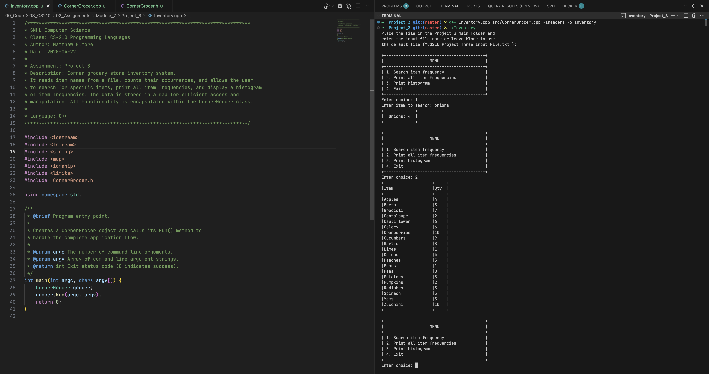
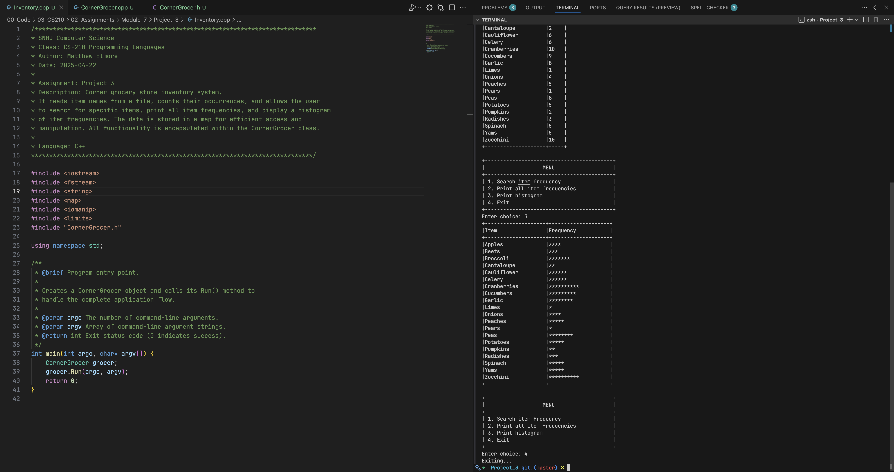

# CornerGrocer Inventory Application

## Overview

The CornerGrocer Inventory Application is a C++ program that reads an inventory file, counts the frequency of each item, and allows the user to interact with the data using a menu-driven interface. The application demonstrates key programming concepts including file I/O, error handling, use of STL map containers, and formatted output, while encapsulating all functionality within the `CornerGrocer` class.

## Functionality

- **File Input & Validation**  
  Upon startup, the user is prompted to enter the name of the input file. The program checks if the file is not empty and can be opened. If the input is invalid, the user is informed and given the option to try again or to use a default file located in the `items` folder (e.g., `items/CS210_Project_Three_Input_File.txt`).

- **Data Loading**  
  The program reads the file and counts the occurrences of each item, storing the data in a `std::map`. The frequency data is also written to a file called `frequency.dat`.

- **User Menu Interface**  
  A decorative menu is presented in a bordered box offering the following options:
  1. **Search Item Frequency:** Prompts for an item name and displays its frequency in a decorative box.
  2. **Print All Item Frequencies:** Displays a formatted table with columns "Item" and "Qty".
  3. **Print Histogram:** Displays a histogram of item frequencies in a table with columns "Item" and "Frequency" (visualized using asterisks).
  4. **Exit:** Terminates the application.

- **Error Handling**  
  The application validates the user’s file input and menu selections and displays appropriate error messages when necessary.

## Code Structure

- **CornerGrocer.h**  
  Contains the declaration of the `CornerGrocer` class. It includes prototypes for:
  - `loadData(const std::string& filename)`
  - `itemFrequency(const std::string& item) const`
  - `printAllFrequencies() const`
  - `printHistogram() const`
  - `run(int argc, char* argv[])`

- **CornerGrocer.cpp**  
  Includes the definitions for all member functions of `CornerGrocer`.  
  This file implements:
  - Data loading from the specified file.
  - Searching for a specific item’s frequency.
  - Displaying all item frequencies and histograms in formatted tables.
  - A full run routine that manages file validation, data processing, and the interactive menu loop.

- **Inventory.cpp**  
  Contains the main() function which simply creates an instance of the `CornerGrocer` class and calls its `run()` method to start the application.

## Usage

To compile the application (from the project root), execute the following command in your terminal:

```bash
g++ Inventory.cpp src/CornerGrocer.cpp -Iheaders -o Inventory
```

Then, run the executable:

```bash
./Inventory
```

When the program starts, it prompts for a filename. Enter a valid file name or choose the default (located under `items/CS210_Project_Three_Input_File.txt`) when prompted, and then interact with the menu options provided.

## Screenshots

Below are sample screenshots demonstrating the application's functionality. 

### Choices 1 and 2

This screenshot shows the user selecting option 1 (Search Item Frequency) followed by option 2 (Print All Item Frequencies).



### Choices 3 and 4

This screenshot shows the user selecting option 3 (Print Histogram) and then option 4 (Exit).



## Conclusion

The CornerGrocer Inventory Application is a comprehensive demonstration of essential C++ programming skills. It covers critical aspects such as file handling, data storage with maps, user input validation, and formatted output. 


# Reflections (Added for module 8)

**Project Summary:**  
The CornerGrocer Inventory Application is designed to solve the problem of efficiently managing grocery inventory data. It reads an inventory file, counts item occurrences, and presents the information through a menu-driven interface. This solution enables quick searches, frequency summaries, and visual histograms of items.

**What I Did Well:**  
- Implemented robust file input validation and error handling.  
- Organized code into distinct functions within the `CornerGrocer` class for clarity.  
- Designed a user-friendly, decorative menu interface for better user interaction.

**Areas for Enhancement:**  
- Improve input validation by handling more edge cases and using exceptions instead of exit calls.  
- Optimize data processing with more efficient algorithms or alternative data structures where applicable.  
- Enhance security by sanitizing input data and ensuring file operations are secure.  
- Implement unit tests to regularly verify the behavior of individual components.

**Challenges and Overcoming Them:**  
- Crafting the interactive menu loop and handling various input scenarios was challenging. This was overcome by thorough testing and incremental improvements.
- I plan to expand my support network by leveraging C++ community forums and additional educational resources to continuously improve. Stackoverflow is a great resource. 

**Transferable Skills:**  
- Mastery of file I/O operations and error handling in C++.  
- Developing maintainable, modular code that separates logic into manageable functions.
- Enhanced problem-solving skills and systematic debugging practices that can be applied to future projects and coursework.

**Program Maintainability and Adaptability:**  
- The code is modularized within the `CornerGrocer` class, making it easier to update and extend functionality.  
- Consistent formatting, comprehensive comments, and error handling practices have been implemented to keep the code both readable and adaptable.
- The separation of interface, implementation, and the main entry point ensures future modifications or expansions can be carried out with minimal impact on existing code.


Author: Matthew Elmore  
Date: 2025-04-22